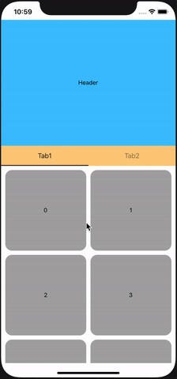
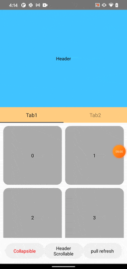

# React native collapsible tabview example
This is just a simple example implementing a tabview with collapsible header. Here we use [react-native-tab-view](https://github.com/react-native-community/react-native-tab-view) in our implemetation.

# Dependencies
Be noticed that we are using react-native `0.62.2` in this example, some breaking changes may lead to crashes.

Accroding to this [post](https://reactnative.dev/blog/2020/03/26/version-0.62#deprecations), `getNode()` is deprecated. As a result, before `0.62.0` you should use `ref.getNode()` in order to get correct `ref` for the `Animated` component.

# Demo
## iOS                    

## Android

